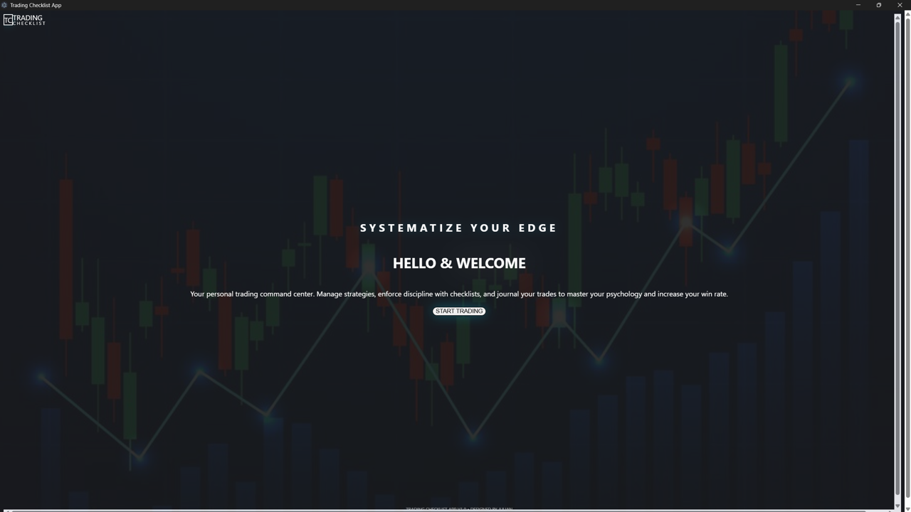
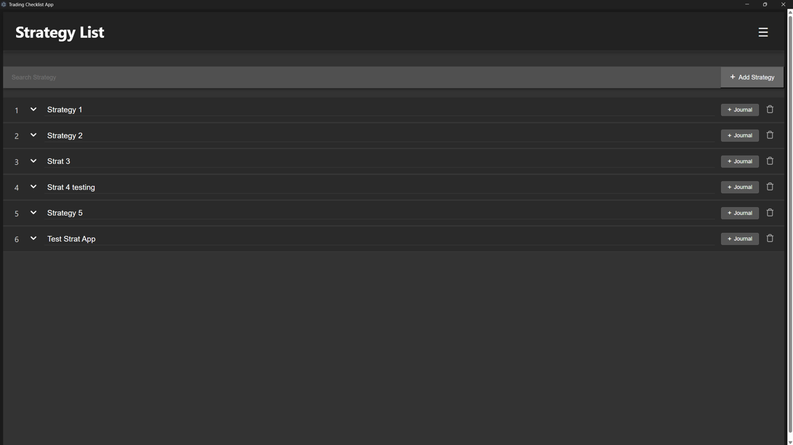
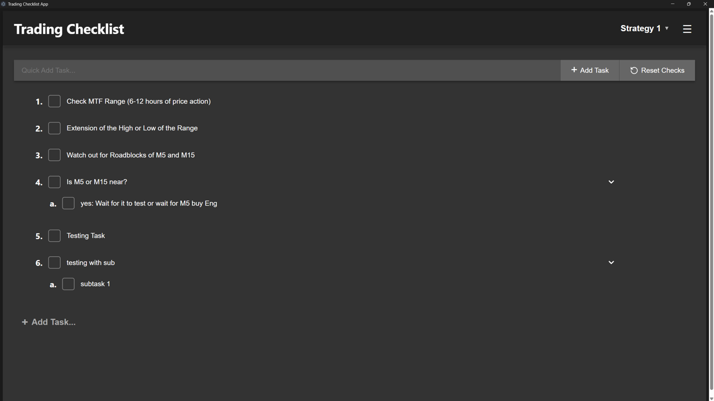
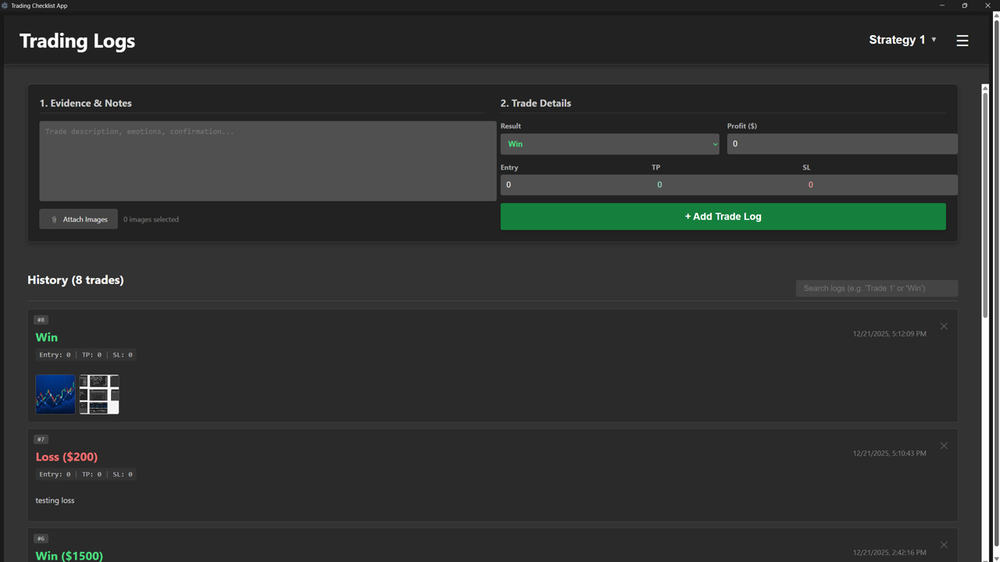

# Trading Checklist App

**A professional desktop application for disciplined traders.**

Execute your trading plan with precision, log every trade, and track your performance—all from a secure, local desktop environment.

*(Screenshot: Landing/Welcome Page)*

## 🎯 What Does This App Do?

This app replaces messy spreadsheets and mental checklists. It forces you to follow your rules before every trade.

*   **✅ Interactive Checklists:** Define your trading rules once. The app forces you to check them off before you can log a trade.
*   **📝 Trade Logging:** Record your Entry, Stop Loss, Take Profit, and Profit/Loss instantly.
*   **📸 Evidence:** Attach screenshots to every trade log to review your setups later.
*   **📊 Performance Tracking:** Automatically calculates your Win Rate and PnL for each strategy.
*   **🔒 100% Private:** Your data lives on **your** computer. No cloud servers, no monthly fees, no data leaks.

---

## 📸 Screenshots

### 1. Strategy Management
Create unlimited strategies, each with its own unique checklist.

### 2. Trade Execution
Follow your sub-tasks step-by-step.

### 3. Trade Journal
Review your history with attached charts and notes.

---

## 📥 How to Download & Install

**Windows**

1.  Click the **[Releases](../../releases)** link on the right side of this page.
2.  Download the latest file named **`Trading Checklist Setup 1.1.0.exe`**.
3.  Run the installer.
    *   *Note: Since this is a private tool not signed by Microsoft, Windows SmartScreen may pop up. Click "More Info" -> "Run Anyway" to complete the installation.*
4.  The app will launch automatically!

---

## 🔄 Updates & Data

*   **Updating:** When a new version is released, simply download the new installer and run it. Your data will be preserved automatically.
*   **Backups:** You can export your entire trading history to a backup folder via the **Settings** menu inside the app.
